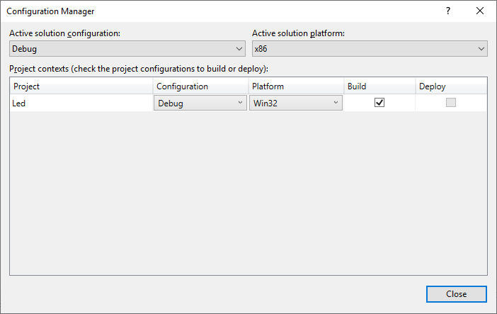

# Halcon Cpp on VS

## 0. Before 前期准备

- 安装Halcon
  - 需要安装完毕18.11stead(19年建议版本)或者19.05stead(19年目前最新版)版本
  - 如果需要调试品牌相机,则需安装相应SDK
  - 如果需要X86环境调试,则安装Halcon Runtime X86

- 安装VS

## 1. VS Project VS项目

### 1. Create Project 创建项目
1. 创建新项目```Ctrl + Shift + N```


 
1. 在下拉菜单中选定需要的
```
Language: C++
Platform: Windows
Project Type: Desktop OR Console
```


2. 选定一个项目(此处以```Console App```为例);
点击下一步;
文本框根据需求修改:


```
Project Name: Led(按需修改,此处Led为例)
Location: C:\xxx\Desktop(按需修改,此处以桌面为例)
Solution: 保持默认
Solution Name: 保持默认(默认生成Project Name 同名)
```
点击下一步;
### 2. Configuration 配置
#### Method 1: Configure Manually 方法1:手动创建
1. 先在配置管理器，把平台改为X64(或X86)



2. 项目属性 -- 配置属性 -- VC++目录 -- 包含目录 -- 添加 ```$(HALCONROOT)\include;$(HALCONROOT)\include\halconcpp```;


3. 项目属性 -- 配置属性 -- VC++目录 -- 库目录 -- 添加 ```$(HALCONROOT)\lib\$(HALCONARCH)```;

4. 项目属性 -- 配置属性 -- 链接器 -- 输入 -- 附加依赖项 -- 添加 ```halconcpp.lib```

5. 添加头文件
6. Main.cpp中加入

```
//Halcon库
#include "HalconCpp.h"
using namespace HalconCpp;

//公共库
using namespace std;
#include <string>
#include <iostream>

//自写函数头
#include "Hal.h"
```

#### Method 1: Import Settings Directly 方法2: 直接导入设置

1. 使用目录下的HalconX64两个文件(VS2019测试可用)
2.  添加头文件
3.  Main.cpp中加入

```
//Halcon库
#include "HalconCpp.h"
using namespace HalconCpp;

//公共库
using namespace std;
#include <string>
#include <iostream>

//自写函数头
#include "Hal.h"
```


## Reference 参考

- [Integrate HDevelop code into a C++ application using the HDevelop Library Project Export](https://www.mvtec.com/news-press/video/detail/hdevelop-library-project-export0/?no_cache=1&cHash=08ee6d47d22df249a146cf637790946e)
- [WIN10 64位下VS2015 MFC直接添加 halcon 12的CPP文件实现视觉检测](https://www.cnblogs.com/tmdsleep/p/5485882.html)
- [Halcon学习（四） 导出C++代码，在VS2010下编译](https://blog.csdn.net/chaipp0607/article/details/69514982)
- [Halcon/MFC混合编程入门](https://blog.csdn.net/lsh_2013/article/details/50539003)
- [halcon第九讲：halcon联合vc实现ocr识别](https://blog.csdn.net/qq_24946843/article/details/82114589)
- [原MFC+Halcon混合编程，图像读入，显示和存储](https://blog.csdn.net/bettyshasha/article/details/51544203)
- [[Halcon]Halcon12在vs2013下的配置](https://blog.csdn.net/kingcooper/article/details/50774760)