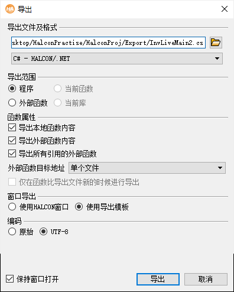

# HalconPractise

## HalconProj
### Export
----

# Export

## Step
### 导出

- 文件 - 导出
  - 选择文件路径
    - eg:```C:/Users/iwake/OneDrive - wake/Desktop/HalconPractise/HalconProj/Export/Export.cs```
  - 选语言 
    - [ ] 文本文件
    - [ ] C
    - [ ] C++
    - [ ] VB
    - [x] C# - HALCON/.NET
  - 导出范围
    - [x] 程序
  - 函数属性:
    - [x] 导出本地函数内容
    - [x] 导出外部函数内容
    - [x] 导出所有引用的外部函数
    -  外部函数目标地址:单个文件
 -  窗口导出
    -  [ ] 使用halcon窗口()
       - ```导出一个独立的工程```(GUI注释)
       -  2Class(装饰有```#if !(NO_EXPORT_MAIN || NO_EXPORT_APP_MAIN)```)
          -  ```public class HDevelopExportApp;```
             -  ```static void Main(string[] args)```
          -  ````public partial class HDevelopExport````
             -  ```public HDevelopExport()```构造函数
             -  ```private void action()```
             -  etc.
       -  比较适合做```Program.cs```(C# Main程序)
    -  [x] 使用导出模板
       - ```使用提供的工程模板导出成一个工程,(仅支持HALCON/.NET和HALCON/COM)```(GUI注释)
       - 1Class
         - ```public partial class HDevelopExport```
           - Member
             - ```public HTuple hv_ExpDefaultWinHandle;```
             - ```HTuple hv_AcqHandle = new HTuple();``` 建议增加
           - Method
             -  ```private void action()```action()函数
             -  ```public void InitHalcon()```初始化函数:初始化默认窗口,一般不用
             -  ```public void RunHalcon(HTuple Window)```run函数:输入```Window```,调用action()
             -  ```public void HDevelopStop()```HDevelopStop()函数:输出```MessageBox
             -  ```public void SomeFeatureStop()```:后期继承增加函数:停止action,关闭相机等;
       
 -  编码
    -  [ ] 原始
    -  [x] UTF-8(用来更好的支持中文)


### 导出代码处理
- 修改
  - ```public partial class HDevelopExport``` -> ```public partial class HalFeature```(eg:```public partial class HalScan```)
  - 将```HTuple hv_AcqHandle = new HTuple();```从method```private void action()```中移动到```public partial class HalFeature```类内
- 增加
  - method```public void StopHalcon()```
    ```
    public void StopHalcon()
    {
        HOperatorSet.CloseFramegrabber(hv_AcqHandle);
    }
    ```
- 删除
  - ```public void HDevelopStop()```


## TODO
- [ ] 增加export不同设置的doc
- [ ] 导出简单的read,cam,引用一个自写函数的模板导出和halcon窗口导出的对比